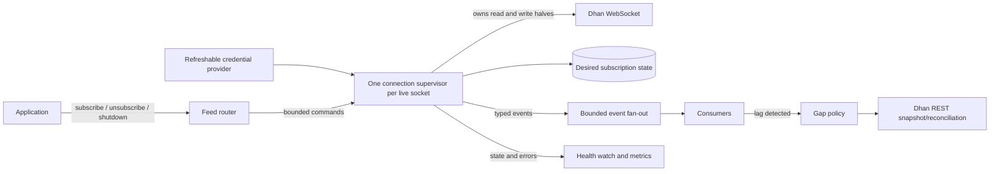
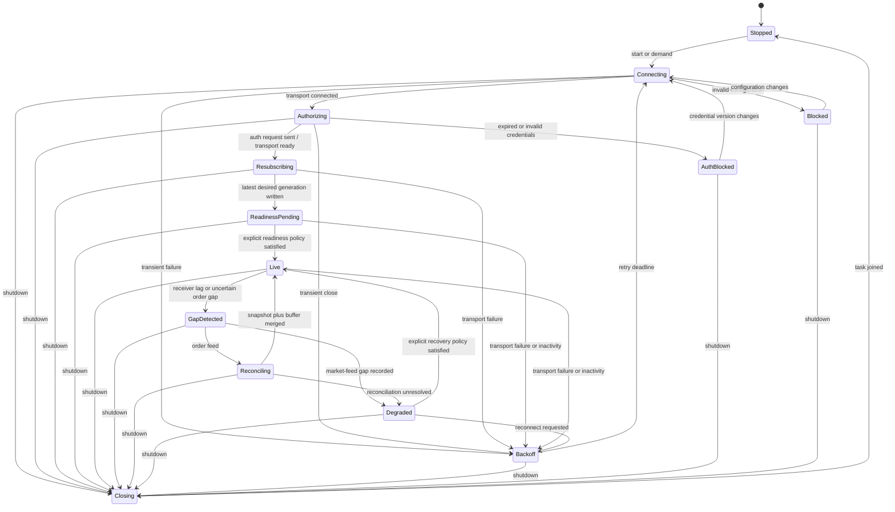

# WebSocket stability design

> - Status: proposed remediation design; not implemented
> - Audit date: 2026-08-11
> - Applies to: standard market feed, live order updates, and future Full Market Depth support

> [!NOTE]
> This is the historical design that guided the subsequent implementation.
> See the current [WebSocket stability guide](websocket-stability.md) and
> [implementation status](implementation-status.md) for shipped behavior and
> remaining limitations.

## Purpose

This document translates the findings in the
[DhanHQ API v2 compliance audit](dhan-v2-compliance-audit.md) into an
implementable WebSocket design.

The current standard market-feed packet parser is mostly aligned with Dhan's
published binary layouts. The principal risk is lifecycle correctness: a
socket can reconnect without restoring subscriptions, a task can die while
health still appears usable, and an order-update gap cannot be detected or
recovered.

This is a design document, not a statement that the behavior already exists.

## Goals

The target implementation should:

- reconnect after transient network failures without losing desired
  subscriptions;
- stop or wait for state changes after non-retryable authentication and
  configuration failures;
- allow credentials to rotate without restarting the process;
- keep Ping/Pong and close handling independent of application polling;
- expose truthful connection and data-quality state;
- shut down without creating orphan tasks or reconnect races;
- preserve Dhan's connection and subscription limits;
- detect receiver lag and other conditions that can create data gaps;
- reconcile order state after every uncertain order-update gap; and
- keep standard market feed and Full Market Depth as separate protocols.

## Non-goals

This design does not promise:

- exactly-once delivery from Dhan;
- recovery of market ticks that Dhan does not replay;
- an order-update sequence number or resume cursor that Dhan does not publish;
- autonomous order placement, cancellation, or modification;
- automatic retries for non-idempotent REST trading operations; or
- compatibility with an undocumented packet layout without captured fixtures.

## Protocol boundaries

These feeds must be modelled as separate transports.

| Feed | Endpoint | Encoding | Header | Primary role |
|---|---|---|---:|---|
| Standard market feed | `wss://api-feed.dhan.co/` | Binary market packets; JSON control | 8 bytes | Ticker, Quote, OI, Previous Close, Full |
| Live order update | `wss://api-order-update.dhan.co/` | JSON text | N/A | Order state changes |
| 20-level depth | `wss://depth-api-feed.dhan.co/twentydepth` | Binary, stacked packets | 12 bytes | 20-level book |
| 200-level depth | `wss://full-depth-api.dhan.co/twohundreddepth` | Binary, stacked packets | 12 bytes | 200-level book |

The existing depth constants do not make depth functional. A depth stream must
have its own authentication URL builder, parser, limits, response types, and
tests. Request codes `23` and `24` must not be accepted by the standard-feed
subscription API.

The depth request envelopes are not interchangeable either. The 200-level feed
uses a flat, single-instrument subscription payload, unlike the instrument-list
shape used by the standard feed and 20-level depth. Each protocol needs exact
request-serialization tests as well as its own response parser.

Official references:

- [Live Market Feed](https://dhanhq.co/docs/v2/live-market-feed/)
- [Live Order Update](https://dhanhq.co/docs/v2/order-update/)
- [Full Market Depth](https://dhanhq.co/docs/v2/full-market-depth/)
- [Data API errors](https://dhanhq.co/docs/v2/annexure/#data-api-error)

## Current implementation

The repository currently provides:

- `MarketFeedStream`, a caller-polled standard-feed stream;
- `OrderUpdateStream`, a caller-polled order-update stream; and
- `DhanFeedManager`, a multi-connection standard-feed manager using background
  reader tasks and broadcast channels.

Relevant implementation:

- [`src/ws/market_feed.rs`](../src/ws/market_feed.rs)
- [`src/ws/order_update.rs`](../src/ws/order_update.rs)
- [`src/ws/manager.rs`](../src/ws/manager.rs)
- [`src/constants.rs`](../src/constants.rs#L18)

## Confirmed failure modes

### MKT-001: reconnect loses normal subscriptions

Severity: critical

The manager starts sockets before callers are allowed to subscribe. A reader
task captures `conn.instruments` once when it is spawned, and reconnect reuses
that original vector. Normal subscriptions are recorded later in a different
map that the task never reads.

Evidence:

- startup: [`src/ws/manager.rs`](../src/ws/manager.rs#L409)
- subscription tracking: [`src/ws/manager.rs`](../src/ws/manager.rs#L481)
- captured snapshot: [`src/ws/manager.rs`](../src/ws/manager.rs#L742)
- stale-state resubscription: [`src/ws/manager.rs`](../src/ws/manager.rs#L883)

Normal usage therefore reconnects the transport but usually restores zero
instruments.

### MKT-002: reconnect stops after one failed attempt

Severity: critical

After a disconnection, the task waits a fixed duration and performs one
`connect_async`. A failed redial ends the task. A successful redial recursively
awaits another `connection_loop`, retaining another future layer for each
successful cycle.

Evidence: [`src/ws/manager.rs`](../src/ws/manager.rs#L860)

There is no jitter, retry ceiling, stable-connection reset, connect deadline,
or fatal/transient classification.

### MKT-003: manager startup is not transactional

Severity: critical

Connections start sequentially. If connection `N` fails, connections
`0..N-1` remain active while `start()` returns an error and `started` remains
false. Calling `start()` again can overwrite their task handles without
stopping the old tasks.

This risks:

- orphan tasks;
- multiple tasks sharing one writer;
- exceeding Dhan's five-connection limit; and
- disconnection code `805` churn.

Evidence: [`src/ws/manager.rs`](../src/ws/manager.rs#L413)

### MKT-004: subscription state is not mode-aware enough

Severity: high

An existing instrument is skipped even when a caller requests a different
mode. Unsubscribe trusts the caller's request code instead of deriving the
inverse of the tracked subscription mode. A failed later chunk can also leave
earlier remote subscriptions active but absent from local tracking.

Evidence:

- assignment and duplicate handling:
  [`src/ws/manager.rs`](../src/ws/manager.rs#L663)
- chunk send followed by delayed tracking:
  [`src/ws/manager.rs`](../src/ws/manager.rs#L461)
- caller-selected unsubscribe mode:
  [`src/ws/manager.rs`](../src/ws/manager.rs#L498)

### MKT-005: manager shutdown is not protocol-graceful

Severity: high

The standalone stream sends Dhan's JSON `RequestCode: 12`, but the manager
sends only a WebSocket Close frame, ignores the result, and immediately aborts
the reader task. It does not wait for a bounded close handshake.

Evidence:

- standalone disconnect:
  [`src/ws/market_feed.rs`](../src/ws/market_feed.rs#L596)
- manager shutdown:
  [`src/ws/manager.rs`](../src/ws/manager.rs#L627)

### MKT-006: the default manager consumes the full socket quota

Severity: high

The default configuration creates five connection slots and `start()` eagerly
opens every slot before any instrument exists. Dhan documents five concurrent
connections per user. The library therefore reserves the entire allowance and
can displace another process or its own oldest connection.

Evidence:

- default connection count:
  [`src/ws/manager.rs`](../src/ws/manager.rs#L180)
- eager startup: [`src/ws/manager.rs`](../src/ws/manager.rs#L418)

### MKT-007: packet length is read but not validated

Severity: high

The parser reads `message_length` from the standard eight-byte header but does
not compare it with the actual frame length before parsing the payload.

Evidence:

- header read: [`src/ws/market_feed.rs`](../src/ws/market_feed.rs#L305)
- payload dispatch: [`src/ws/market_feed.rs`](../src/ws/market_feed.rs#L340)

Trailing data or a contradictory declared length can be accepted silently.
Current fixed-layout parsers have minimum-size checks, so this audit did not
find an immediate short-packet panic for known response codes.

### MKT-008: public subscription input is under-validated

Severity: high

The standalone stream accepts any `FeedRequestCode` enum variant, including
Connect, Disconnect, unsubscribe, and depth variants that are inappropriate
for `subscribe()`. It does not accept arbitrary numeric values, but its closed
enum still mixes protocol operations with subscription modes. The stream also
does not chunk or reject more than 100 instruments or enforce the 5,000
instrument total.

The manager chunks to 100, but public configuration can exceed connection and
instrument limits. A zero broadcast capacity reaches `broadcast::channel(0)`,
which panics.

Evidence:

- standalone subscribe/unsubscribe:
  [`src/ws/market_feed.rs`](../src/ws/market_feed.rs#L550)
- manager channel construction:
  [`src/ws/manager.rs`](../src/ws/manager.rs#L370)

### MKT-009: running sockets cannot consume renewed credentials

Severity: high

The manager clones its token into the task and reuses that value on reconnect.
Updating `DhanClient` through `set_access_token` does not update either
WebSocket implementation.

Evidence:

- REST token replacement: [`src/client.rs`](../src/client.rs#L103)
- manager token capture: [`src/ws/manager.rs`](../src/ws/manager.rs#L742)
- stale reconnect token: [`src/ws/manager.rs`](../src/ws/manager.rs#L869)

### MKT-010: failures are log-only and health is misleading

Severity: high

Transport errors, parse errors, reconnect failures, and resubscribe failures
are logged but do not reach callers as durable lifecycle state. A task can end
while broadcast senders remain open. Consumers may then wait indefinitely.

`reconnect_count` is reported but never incremented. `is_alive` only checks
whether the task is unfinished, which still reports true while disconnected or
sleeping before retry.

Evidence: [`src/ws/manager.rs`](../src/ws/manager.rs#L604)

### MKT-011: control-plane progress depends on polling

Severity: medium

Tungstenite automatically queues Pong responses when Ping frames are read, so
the current `Message::Ping(_) => continue` handling is not inherently wrong.
However, a caller-polled standalone stream does not read or flush control
frames while the caller is busy or stops polling.

Dhan documents a 10-second Ping interval and a 40-second close window for the
standard market feed. A dedicated connection task should therefore own
continuous reads and enforce an independent inactivity deadline.

Evidence:

- published constants: [`src/constants.rs`](../src/constants.rs#L87)
- caller-polled stream: [`src/ws/market_feed.rs`](../src/ws/market_feed.rs#L611)

### MKT-012: backpressure can create silent gaps

Severity: high

Tokio broadcast channels are bounded. Slow receivers receive `Lagged`, but the
manager records no gap metric or degraded state. Send failures are ignored.

Construction discards the initial broadcast receiver, so packets emitted
before a caller creates a receiver are retained nowhere. That loss window can
include the period after server subscription has succeeded. This is especially
important for Dhan's one-shot Previous Close packet.

Evidence:

- discarded receivers: [`src/ws/manager.rs`](../src/ws/manager.rs#L379)
- receiver acquisition: [`src/ws/manager.rs`](../src/ws/manager.rs#L558)

### MKT-013: the shared writer can block control operations

Severity: medium

The writer mutex is held across asynchronous sends. With no write deadline, a
wedged socket can block subscription, resubscription, and shutdown.

Evidence:

- subscribe send: [`src/ws/manager.rs`](../src/ws/manager.rs#L470)
- unsubscribe send: [`src/ws/manager.rs`](../src/ws/manager.rs#L535)
- resubscribe send: [`src/ws/manager.rs`](../src/ws/manager.rs#L921)

### ORD-001: order updates have no recovery or gap reconciliation

Severity: critical

`OrderUpdateStream` is a one-shot socket. Network failure produces one error;
Close or EOF ends the stream. There is no reconnect, reauthentication, replay,
or REST snapshot reconciliation.

Evidence: [`src/ws/order_update.rs`](../src/ws/order_update.rs#L276)

Dhan documents no sequence number, resume cursor, or replay guarantee. A
reconnect alone cannot prove that no partial fill, rejection, cancellation, or
terminal update was missed.

### ORD-002: transport success is presented as feed success

Severity: high

SELF and PARTNER connection methods:

1. complete the WebSocket upgrade;
2. send authorization JSON; and
3. log success and return the stream.

They do not observe an authentication result. Dhan does not document a positive
authentication ACK for order updates, so the API must not claim more than
`TransportConnected` or `Authorizing` at that point.

Evidence: [`src/ws/order_update.rs`](../src/ws/order_update.rs#L286)

### ORD-003: close diagnostics are discarded

Severity: high

A Close frame's code and reason are ignored and returned as ordinary
end-of-stream, indistinguishable from EOF. Authentication rejection, policy
closure, server shutdown, and clean client shutdown therefore look the same.

Evidence: [`src/ws/order_update.rs`](../src/ws/order_update.rs#L368)

### ORD-004: order payload discrimination is weak

Severity: medium

Every text frame is deserialized directly as an order update. The `Type` value
is not validated as a discriminator, so control or authentication JSON becomes
a generic serde error. Some documented numeric values are exposed as
`serde_json::Value`, pushing validation onto each caller.

Evidence: [`src/ws/order_update.rs`](../src/ws/order_update.rs#L345)

### ORD-005: Postback accepts an empty object

Severity: medium

All Postback fields are optional, including client ID, order ID, and status, so
`{}` is accepted as a valid value.

Evidence: [`src/types/postback.rs`](../src/types/postback.rs#L34)

Dhan does not document a webhook signature. Postback receivers should validate
minimum identity/status fields and reconcile events with authenticated REST
state; deserialization alone is not authenticity.

## Target invariants

The implementation should preserve these invariants:

1. exactly one owner task reads and writes each socket;
2. desired subscription state exists independently of transport state;
3. reconnect always reads the latest desired state;
4. a mode change is represented as a real state transition, not a duplicate;
5. every task termination emits a terminal lifecycle event;
6. a manager cannot report `Live` when its task is dead or in backoff;
7. no socket survives a failed transactional startup unnoticed;
8. shutdown disables reconnect before closing transports;
9. credential renewal is observable by future connection attempts;
10. receiver lag changes data quality to `GapDetected`;
11. an order-update gap always triggers a reconciliation attempt, and any
    missing authorization is surfaced as unresolved; and
12. standard feed and depth feed types cannot be mixed accidentally.

## Target architecture



Key ownership rule: the socket writer should not be shared behind a mutex.
Only the supervisor writes to the socket. Other tasks send bounded commands.

## Connection state machine



Not every feed can prove an `Authorized` state. Writing the desired subscription
generation proves neither remote acknowledgement nor authentication. Where
Dhan provides no positive ACK, expose `Authorizing`, `TransportReady`, or
`ReadinessPending` honestly and transition to `Live` only under a documented,
testable policy—for example, the first valid frame for the current transport or
successful order reconciliation. Do not label a completed HTTP upgrade or
successful write as authenticated.

## Core types

The following sketch illustrates responsibilities rather than prescribing
exact public names:

```rust
enum ConnectionCommand {
    ReplaceDesired(DesiredSubscriptions),
    Subscribe(Vec<Subscription>),
    Unsubscribe(Vec<InstrumentKey>),
    CredentialsChanged(u64),
    Shutdown,
}

enum ConnectionState {
    Stopped,
    Connecting { attempt: u64 },
    Authorizing,
    Resubscribing { remaining: usize },
    ReadinessPending,
    Live,
    GapDetected { cause: GapCause },
    Reconciling { clients_pending: usize },
    Degraded { cause: GapCause },
    Backoff { attempt: u64, retry_at: Instant },
    AuthBlocked { reason: String },
    Blocked { reason: String },
    Closing,
}

enum LifecycleEvent {
    StateChanged(ConnectionState),
    Disconnect { code: Option<i16>, reason: String },
    ParseError { response_code: Option<u8>, error: String },
    ReceiverLag { dropped: u64 },
    GapDetected { cause: GapCause },
    Reconciled { source: ReconciliationSource },
    GapUnresolved { client_id: Option<String>, reason: String },
    Stopped { result: Result<(), StableError> },
}

struct Subscription {
    instrument: Instrument,
    mode: StandardFeedMode,
}

enum StandardFeedMode {
    Ticker,
    Quote,
    Full,
}
```

The standard subscription type should not contain Connect, Disconnect, depth,
or unsubscribe request codes. Those are protocol operations, not feed modes.

## Desired versus applied subscription state

The manager needs two distinct concepts:

- **desired state**: what the caller currently wants; and
- **applied generation**: the desired-state generation last sent on the current
  transport.

Dhan's standard feed does not document per-subscription acknowledgements, so
the client cannot truthfully claim remote acknowledgement for each instrument.
It can record that a generation was written successfully to the current
transport. That written generation is not, by itself, the readiness criterion
for `Live`.

Recommended rules:

1. update desired state before scheduling network work;
2. increment a monotonically increasing desired generation;
3. on a new transport, treat the applied generation as zero;
4. send the latest complete desired state in chunks of at most 100;
5. if desired state changes during resubscription, repeat reconciliation until
   the written generation equals the latest desired generation;
6. when changing mode, unsubscribe the previous mode and subscribe the new
   mode in a defined order;
7. never resurrect an instrument removed during backoff; and
8. surface a partial-write error because remote state is uncertain until the
   next clean reconnect.

## Connection allocation

Connections should be opened lazily.

Suggested behavior:

- zero subscriptions means zero live market-feed sockets;
- allocate the first socket on first demand;
- allocate another socket only when the current capacity policy requires it;
- never exceed the configured limit or Dhan's limit of five;
- reserve quota if the application also uses Full Market Depth or another
  process under the same Dhan user; and
- close an empty socket after a configurable idle period, unless callers opt
  into a warm connection.

Startup should be transactional. If a multi-socket operation cannot complete,
cancel and join every task started by that operation before returning the
error.

## Reconnect policy

### Proposed defaults

These are library design defaults, not Dhan requirements:

| Setting | Proposed value |
|---|---:|
| Initial retry base | 250 ms |
| Multiplier | 2 |
| Maximum retry base | 30 s |
| Jitter | Full jitter from zero to current retry base |
| Connect/upgrade timeout | 10 s |
| Write/flush timeout | 5 s |
| Graceful-close timeout | 5 s |
| Standard-feed no-frame deadline | 30 s by default, configurable; Dhan documents 10 s Ping and 40 s close behavior |
| Stable-period retry reset | 60 s of healthy traffic |

Full jitter prevents all managed sockets from redialling simultaneously.
Retries should continue for transient failures until cancellation; a caller may
configure a maximum elapsed duration for environments that prefer terminal
failure.

### Dhan disconnect classification

The current annexure documents these Data API errors:

| Code | Documented meaning | Proposed action |
|---:|---|---|
| 800 | Internal server error | Retry with backoff. |
| 804 | Instrument limit exceeded | Stop this attempt; correct desired state/configuration. |
| 805 | Too many requests or connections | Enter longer backoff; reduce/open fewer sockets; surface prominently. |
| 806 | Data APIs not subscribed | Block until account entitlement changes. |
| 807 | Access token expired | Request fresh credentials; retry only after credential version changes. |
| 808 | Client ID or access token invalid | Authentication-blocked; do not hot-loop. |
| 809 | Access token invalid | Authentication-blocked; request credential replacement. |
| 810 | Client ID invalid | Configuration-blocked; require caller change. |
| 811-814 | Invalid expiry/date/security/request | Treat as request/configuration error, not a transport retry. |

Unknown disconnect codes should be surfaced intact and use a conservative
bounded backoff policy. The original numeric code and raw close code/reason
must remain available to diagnostics.

## Credential rotation

Use a refreshable credential provider rather than a cloned token string.

Possible implementation choices include:

- a `watch::Receiver<CredentialSnapshot>`;
- an async callback returning the current credential snapshot; or
- a trait implemented by application-owned token storage.

Each snapshot should have a monotonically increasing version. An
authentication-blocked supervisor waits for either shutdown or a higher
credential version; it must not retry the same expired token indefinitely.

Secrets must be redacted from `Debug`, errors, tracing fields, metrics labels,
and URLs stored in error context.

## Standard market-feed liveness

The supervisor continuously polls the socket even if downstream consumers are
slow or idle. It should track:

- last frame time;
- last binary data time;
- last Ping time;
- last successful write time;
- current retry attempt;
- current desired and applied generations; and
- last disconnect/error.

Do not add a manual Pong merely because the current code matches `Ping`.
Tungstenite already implements control-frame semantics. The supervisor must
keep polling and apply timeouts around the transport so those semantics can
make progress.

## Packet parsing hardening

Before dispatching a standard-feed packet:

1. require at least the eight-byte header;
2. decode the response code, declared message length, exchange segment, and
   security ID;
3. reject a declared length that does not equal the binary message length for
   fixed single-packet formats;
4. validate the exact documented size for known response codes;
5. preserve unknown response codes as typed unknown events or errors;
6. never index without a prior checked bound; and
7. distinguish malformed input from unsupported response types.

Full Market Depth must use a separate 12-byte framing parser capable of stacked
packets. It should not weaken standard-feed exact-length checks.

## Order-update recovery

### Why reconnect is insufficient

Dhan does not document:

- a sequence number;
- a resume cursor;
- replay after reconnect;
- ordering across reconnects; or
- exactly-once delivery.

Any disconnect therefore creates an uncertain interval. The API must surface a
gap and reconcile with authenticated REST state.

### Proposed reconciliation sequence

For a SELF stream, the current client credential can normally provide the REST
snapshot. For a PARTNER stream, the per-client authorization provider described
below is required; the WebSocket partner secret alone is not assumed to grant
REST access.

1. mark data quality as `GapDetected` immediately on uncertain disconnect;
2. reconnect and send the current SELF or PARTNER authentication envelope;
3. begin reading into a bounded reconciliation buffer;
4. fetch each affected client's current order book through an authorized
   `GET /v2/orders` context;
5. fetch the relevant trade book or per-order trades through the same context;
6. normalize the REST snapshot and buffered WebSocket updates;
7. merge deterministically;
8. emit corrected state and a `Reconciled` event; and
9. transition to `Live`, while retaining that the interval was reconciled
   rather than replayed.

Starting the socket reader before the REST fetch narrows the race between
snapshot time and resumption. If the reconciliation buffer overflows, restart
the snapshot process instead of silently dropping events.

### Merge and deduplication

Dhan does not expose a documented global sequence. A practical deduplication
key should use, at minimum:

- order ID;
- status;
- traded quantity;
- price or average traded price where relevant; and
- update time or exchange time as supporting—not sole—ordering evidence.

State application should be idempotent. Terminal REST state must not be rolled
back by a stale buffered event. Ambiguous conflicts should remain visible as a
reconciliation warning rather than being silently guessed.

### Partner reconciliation boundary

A PARTNER order-update stream may carry events for multiple client IDs. One
ordinary `DhanClient` credential set cannot be assumed to authorize REST order
and trade snapshots for every client represented on that stream.

Managed partner recovery therefore needs an application-supplied reconciliation
provider that:

- resolves each affected client ID to an authorized, refreshable REST context;
- keeps per-client buffers and state isolated;
- fetches only data the partner is authorized to access;
- reports `GapUnresolved` for clients without an available REST context; and
- never marks the whole partner stream reconciled merely because one client
  completed reconciliation.

If Dhan offers a partner-level snapshot API, it can implement this provider,
but that capability must be verified rather than inferred from the WebSocket
partner secret.

### Authentication state

The order-update page does not document a positive authentication ACK. The
public state model should therefore distinguish:

- TCP/WebSocket transport connected;
- authorization request sent;
- first valid order event observed;
- server rejection/close; and
- reconciled live state.

A quiet account may produce no first event. Do not invent a positive ACK;
provide honest state and an authorization timeout/close diagnostic instead.

## Backpressure and fan-out

Market ticks can arrive faster than a consumer processes them. The library
must define its policy instead of treating a bounded channel as lossless.

Recommended options:

- raw event stream with explicit `Lagged { dropped }` notifications;
- latest-value cache keyed by instrument for consumers that need state rather
  than every tick;
- separate bounded channels for lifecycle events so a tick flood cannot hide a
  disconnect; and
- metrics for sent, dropped, lagged, parsed, malformed, and unknown packets.

Previous Close and other one-shot values should be stored in a state cache or
require receivers before subscription. They should not depend on a broadcast
sender having a receiver at exactly the right moment.

For order updates, channel overflow is a data-integrity event. It must trigger
`GapDetected` and reconciliation.

A standard market-feed gap cannot be reconstructed tick-for-tick because Dhan
does not document replay. Move that connection to `Degraded`, mark cached values
with their original timestamps, and require an explicit recovery policy such as
a fresh REST quote/state snapshot or caller acknowledgement. Recovery may
restore current state; it must not claim that the missing tick history was
replayed.

## Shutdown sequence

The supervisor should implement this bounded sequence:

1. atomically set `shutdown_requested`, preventing future reconnects;
2. stop accepting new subscribe/unsubscribe commands;
3. for standard feed, send JSON `{"RequestCode": 12}`;
4. flush with a write timeout;
5. send a WebSocket Close frame;
6. continue polling until the peer Close or timeout;
7. close output channels with a terminal `Stopped` event;
8. join the supervisor task; and
9. abort only if the close/join deadline expires.

Dropping a public manager from synchronous `Drop` cannot await this sequence.
`Drop` may cancel as a last-resort safety mechanism, but callers should receive
an explicit async `shutdown()` and documentation that it must be awaited.

## Observability

### Per-connection state

Expose at least:

- stable connection ID;
- protocol kind;
- lifecycle state;
- desired/applied subscription counts and generation;
- transport-connected and data-live booleans as separate concepts;
- last frame, Ping, data, and state-change times;
- last close code, Dhan disconnect code, and redacted error;
- reconnect count and current attempt;
- current backoff deadline;
- parser error and unknown-packet counts;
- downstream lag/drop counts; and
- credential version, never the credential value.

### Events versus snapshots

Use both:

- a `watch`-style latest health snapshot for monitoring; and
- a bounded lifecycle event stream for transitions and diagnostics.

Consumers should not need to infer connection health from whether a market
tick happened recently.

### Logging rules

Never log:

- access tokens;
- PINs or TOTPs;
- partner secrets;
- complete authentication URLs;
- complete malformed order payloads; or
- secrets embedded in `Debug` output.

Use operation names, connection IDs, numeric close/disconnect codes, payload
lengths, and redacted hashes.

## Error model

The WebSocket error model should distinguish:

- configuration and invalid public input;
- transport connection and timeout;
- authentication blocked or expired;
- Dhan disconnect code;
- WebSocket close code and reason;
- protocol/framing error;
- unsupported response code;
- serialization/deserialization error;
- downstream lag/gap;
- reconciliation failure; and
- cancellation/shutdown timeout.

Errors should retain sources and structured metadata. A logged error is not a
substitute for delivering a lifecycle transition to the caller.

## Test strategy

No broker credentials are needed for most stability tests. Add injectable HTTP
and WebSocket endpoints and use local deterministic servers.

### Standard packet fixtures

For every supported response code:

- parse a golden documented packet;
- assert every decoded field and endianness;
- reject every truncation boundary;
- reject declared-length mismatch;
- reject or explicitly handle trailing data;
- preserve unknown response codes safely; and
- fuzz arbitrary bytes to establish no-panic behavior.

### Market-feed lifecycle tests

1. assert exact connection URL query fields;
2. assert subscriptions are split into batches of at most 100;
3. subscribe after start, disconnect, and assert current state is restored;
4. change desired state during backoff and ensure removed instruments are not
   resurrected;
5. change mode and assert correct unsubscribe/subscribe control frames;
6. fail several consecutive dials and assert eventual recovery;
7. return codes `804` through `810` and assert classification;
8. rotate credentials and assert only the new token is reused;
9. fail connection `N` during startup and assert all earlier tasks stop;
10. trigger Ping while consumers are blocked and observe timely transport
    progress;
11. stop all frames and assert the inactivity watchdog reconnects;
12. force partial chunk writes and assert remote-state uncertainty is surfaced;
13. overflow a receiver and assert lag metrics/gap events;
14. subscribe before/after receiver creation and protect one-shot data; and
15. perform graceful shutdown and assert JSON disconnect, Close handshake, and
    task termination.

### Order-update lifecycle tests

1. assert exact SELF and PARTNER authentication JSON;
2. send authorization/control JSON and produce a typed lifecycle event;
3. preserve Close code and reason;
4. drop TCP abruptly and assert repeated jittered retry;
5. rotate credentials between attempts;
6. simulate an update missed during the gap and reconcile it from REST;
7. merge duplicate and out-of-order states idempotently;
8. overflow the reconciliation buffer and restart reconciliation;
9. validate the `Type` discriminator;
10. accept documented null/numeric variants through explicit tolerant parsing;
11. verify raw payloads and credentials never enter captured tracing output;
12. ensure a quiet socket is not falsely reported as positively authenticated;
13. reconcile a PARTNER stream per client through an application-supplied
    credential provider and leave clients without credentials unresolved; and
14. await close handshake during shutdown.

### Full Market Depth tests

1. assert the dedicated 20-level and 200-level URL shapes;
2. assert the exact 20-level instrument-list request envelope;
3. assert the exact flat, single-instrument 200-level request envelope;
4. parse exact 12-byte headers;
5. parse multiple stacked packets in one binary message;
6. reject incomplete packet stacks;
7. verify response codes `41` and `51`;
8. parse response-code-`50` disconnect packets and preserve their reason;
9. enforce feed-specific instrument limits; and
10. ensure depth codes cannot be routed through the standard feed.

### Time control

Use paused Tokio time for retry and timeout tests. Inject a deterministic random
source or retry-delay strategy so full-jitter assertions are stable without
sleeping in real time.

## Implementation phases

### Phase 1: characterize and protect current behavior

- add golden standard-feed packet fixtures;
- add injectable endpoints;
- capture current connection/auth frames with local servers;
- add redaction tests; and
- make declared-length validation explicit.

Acceptance gate: parser and protocol tests pass without live credentials.

### Phase 2: replace the standard-feed manager lifecycle

- introduce one supervisor per socket;
- move all writes behind a bounded command channel;
- create desired-state generations;
- implement iterative retry and typed health;
- make startup and shutdown transactional; and
- open sockets lazily.

Acceptance gate: repeated reconnect, resubscription, token rotation, partial
startup, lag, and shutdown tests all pass; no old manager task survives a test.

### Phase 3: managed order-update recovery

- add the order-update supervisor;
- preserve close/auth diagnostics;
- buffer during reconciliation;
- integrate order/trade REST snapshots; and
- expose `GapDetected` and `Reconciled` states.

Acceptance gate: simulated missed fills and terminal updates reconcile
correctly, and buffer overflow cannot be silent.

### Phase 4: separate Full Market Depth implementations

- add dedicated connection builders and types;
- implement 12-byte and stacked-packet parsers;
- enforce feed-specific limits; and
- remove depth codes from the standard-feed public mode type.

Acceptance gate: all documented depth fixtures pass, and the Rust type system
prevents selecting a depth mode on a standard feed.

### Phase 5: authenticated smoke and soak tests

- run non-destructive authenticated connection tests;
- verify real disconnect/auth behavior with sanitized evidence;
- compare real multi-minute packet samples with fixtures;
- exercise token renewal without exposing credentials; and
- run a reconnect soak test under controlled network interruption.

Acceptance gate: distinguish local proof from live Dhan proof in the release
record; never claim live recovery from compilation alone.

## Compatibility considerations

The safer API may require breaking changes:

- `FeedRequestCode` should no longer be accepted as a subscription mode;
- health should become typed state rather than `is_alive`;
- order-update consumers should receive lifecycle/gap events in addition to
  order data;
- `connect()` may return a handle whose authentication state is observed
  separately; and
- shutdown should require awaiting task completion.

If backward compatibility is required, retain the current raw streams as
low-level primitives and introduce explicitly managed types. Do not describe a
low-level caller-polled stream as automatically stable.

## Definition of done

WebSocket stabilization is complete only when:

- every live socket has exactly one owner task;
- retry is iterative and proven across repeated failures;
- reconnect restores the latest desired subscriptions;
- token rotation is proven without restart;
- partial startup leaves no tasks or sockets alive;
- close and Dhan disconnect reasons reach callers;
- inactivity and receiver lag produce explicit state changes;
- order-update gaps trigger and complete REST reconciliation;
- standard and depth protocols are separated by types and parsers;
- shutdown is bounded, graceful, and joined; and
- all of these properties are covered by deterministic local tests.
